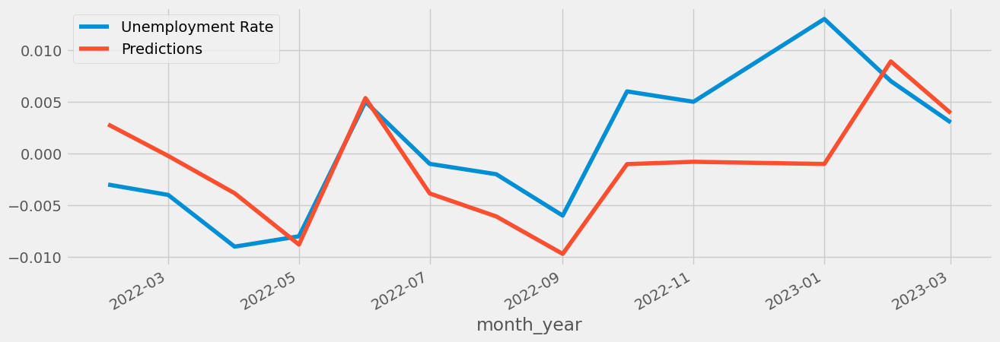
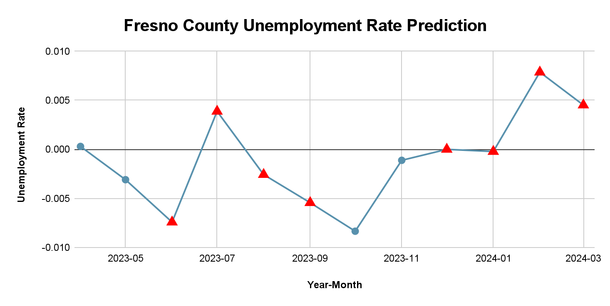

# Local-Area-Unemployment-Statistics-California

## Dataset 

Local Area Unemployment Statistics pulled from ca.gov website details a significant amount of information, the most important being:  

- Date   
- Year   
- Month   
- Labor Force   
- Employment   
- Unemployment   
- Unemployment Rate  

__['Local Area Unemployment Statistics'](https://data.ca.gov/dataset/local-area-unemployment-statistics-laus)__  current as of March, 2023.   

|index|Area Type|Area Name|Date|Year|Month|Seasonally Adjusted \(Y/N\)|Status \(Preliminary / Final\)|Labor Force|Employment|Unemployment|Unemployment Rate|
|---|---|---|---|---|---|---|---|---|---|---|---|
|0|State|California|01/01/1976|1976|January|N|Final|9672362|8668016|1004346|0\.104|
|1|State|California|01/01/1976|1976|January|Y|Final|9774280|8875685|898595|0\.092|
|2|County|Los Angeles County|01/01/1976|1976|January|N|Final|3364151|3040058|324093|0\.096|
|3|County|Los Angeles County|01/01/1976|1976|January|Y|Final|3381856|3081806|300050|0\.089|
|4|Metropolitan Area|Los Angeles-Long Beach-Glendale MD|01/01/1976|1976|January|N|Final|3364151|3040058|324093|0\.096|

## Business Problem

According to a recent article posted on what could be considered America's most uncelebrated holiday __['National Skilled Trades Day'](https://gvwire.com/2023/05/02/on-national-skilled-trades-day-americas-labor-shortage-looms/)__, there is a high need for skilled labor in the job market. Specifically, these are blue collar jobs in the trades (carpentry, HVAC, iron work, sheet metal, and aviation). There is a growing sentiment in the United States that there aren't people willing to work, but according to the article by Elen  Theodossiou and Steven F. Hipple, __['Unemployment remains high in 2010'](https://www.bls.gov/opub/mlr/2011/03/art1full.pdf)__, __"Workers with less education continued to experience a substantially higher unemployment rate than did better educated members of the labor force."__(4)
  

Taking into consideration that ALL the jobs highlighted in the article __['National Skilled Trades Day'](https://gvwire.com/2023/05/02/on-national-skilled-trades-day-americas-labor-shortage-looms/)__ require some kind of certificate of completion from a trade school or on the job training, it is our intention to look at counties in California with high unemployment rates and attempt to identify members of specific business sectors that the EDD (State of California Employment Development Department) can recruit for training in these high demand jobs. 
 

Are there then groups in our data on counties and unemployment rate that may shed light on a potential group of candidates for a proposal for an EDD sponsored version of job training? That is the goal of our project. 
 

## Method of Analysis/ Time Series Analysis of California's Unemployment Rate

Now that we have determined that there is a relationship between higher rates of unemployment and education we will look to determine a predictive model on the time series data we have for the top five crop producing counties in California and determine when the highest rate of unemployment (seasonality) occurs for each county and determine when a potential educational program could be implemented.  

With this data we can carefully craft the skeleton of a 6-month educational program and through the published opinions of local experts and government entities begin looking at potential fields of study/educational partners to reach out to in order to create a specialized educational program.   

Ultimately, the reason for making these suggestions is to help improve the __[living conditions](https://www.hcd.ca.gov/planning-and-community-development/housing-elements/building-blocks/farmworkers)__ and occupational opportunities of skilled laborers in the agricultural field.   

RNN (LSTM) Prediction on Test Data / Fresno County

### College Educational Programs and Community College opportunties for trades and beyond

The reason for proposing trade school opportunities primarily is that there is a significantly smaller amount of __[training to deployment](https://toptrade.school/how-long-does-trade-school-take/)__ than traditional four year schools, something to the tune of 6 months to a year for a full time student. Since our proposal is for off-season migrant and farm workers who would be able to take advantage of these programs during the off-season, time is a crucial factor. From here however, once given the ability to rise financially and educationally, our educated workforce would be able to improve living conditions and explore other educational opportunities.   
 

Predictive model of Fresno County Unemployment Rate

### Limitations of the data and information available

The greatest limitation of data available is the number of actual migrant workers currently in employ in California. The figures that we were able to find were from 2017; this may be smaller or larger in 2023 and could affect the analysis of our potential pool of workers. This could also affect labor pool, employed, unemployed, and unemployment rate numbers. 

# Concluding Remarks

Based on the business problem I believe that we have successfully identified a group of workers inside California that would be considered capable of filling the skilled labor gap present in our communities.  

The groups of workers in question is ag/migrant workers and though they are critical to the infrastructure and supply of food not only for California, but for the world (California is the fourth largest supplier of crops in the world), Chris Thornberg in his __[presentation to Tulare County officials](https://thesungazette.com/article/news/2022/02/22/economist-chris-thornberg-tells-tulare-county-to-focus-on-workers-workers-workers/)__ stated that there are only three ways to increase the workforce in a region:   

- Extensive: increasing labor force through immigration (SR) or birthrates (LR) 
- Intensive: raising participation rates among the existing population
- Productivity enhancements: capital investments/ skill training  

We have suggested in some part, all three of these measures:   

- Extensive: migrant workers support the largest economy in the central valley of California but suffer the largest inequities in regards to pay, shelter, and opportunity for growth; disruption of that business model in the form of an educational program like the one suggested would inevitably shake up the structure of the current and afford more opportunity to incoming migrant workers thus filling the gaps in the laborforce while forcing __[conditions](https://calmatters.org/california-divide/2023/02/farmworkers-conditions-california-report/)__ to improve based on competition with an educational program that would afford migrant workers opportunities to further their upward mobility in America. 
- Intensive: migrant workers already live and exist in the central valley of California and suffer from unemployment due to the seasonal nature of their work. Though they are supported by a union and are given the ability to look for work during their times of unemployment, there is no built in educational program that might afford migrant workers the ability to find work. 
- Productivity enhancements: skilled labor would be considered a form of skill training; the beauty of skilled labor is that oftentimes once an apprenticeship has begun there are opportunities to be paid for work and at higher rates than what is offered to migrant and seasonal farm workers. 

